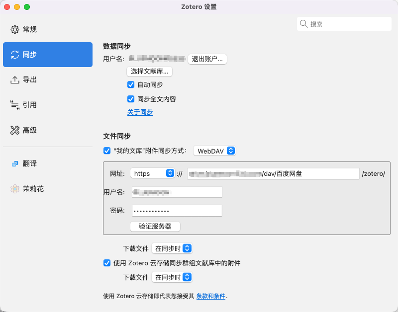

# 使用OpenList配置Zotero同步

## 关于Zotero同步的一些碎碎念

之前在使用Zotero时还没有接触自建站的诸多操作，各大网盘对于WebDAV的限制诸多，最终根据网上的教程利用坚果云配置好了Zotero的同步服务。

但是，坚果云的同步需要在每个使用Zotero的系统中配置自动同步和开机自启，如果不打开他们的软件就无法进行同步，虽然占用不多，但是这显然触犯了我的“**赛博洁癖**”。

终于！在今天，从一大堆的 To Do List 中，我开始处理自建站的WebDAV服务，实现了在我各个设备上根除坚果云！

::: info 题外话
很好笑的一点是，我的To Do List 是准备部署在网页的某个地方的，但是目前还没有实现，所以我的 To Do List 也在我的 To Do List 中， 这何尝不是一种递归。。。
:::

## OpenList的相关配置

::: info 关于OpenList是什么
OpenList 是一个由 OpenList 团队独立维护的开源项目，遵循 AGPL-3.0 许可证，致力于保持完整的代码开放性和修改透明性。

支持在自己的网站上挂载自己的各种云存储服务，ALL IN ONE的魅力！
:::

WebDAV（Web Distributed Authoring and Versioning，Web分布式创作和版本控制）是HTTP协议的扩展，它允许用户像操作本地文件夹一样，通过网络直接在服务器上读写、编辑、移动和删除文件。

简单来说，WebDAV把网络存储变成了一个可以直接挂载的网络磁盘，你可以用文件管理器、播放器等各种软件直接访问远程文件，而不需要先下载到本地。它被广泛应用于网盘服务、协作办公、文件同步等场景，是一种成熟且标准化的文件共享协议。

OpenList可以作为WebDAV服务器运行，允许用户通过WebDAV协议访问和管理存储在各种云盘（如阿里云盘、OneDrive、S3等40+种存储服务）中的文件，就像访问本地文件一样。

而OpenList原生支持这一个服务，即你使用 `[prefix].[domain].com:5244/dav/`即可以访问WebDav服务。那么既然原生支持的话，我们部署好OpenList服务，准备好一个具有WebDAV权限的用户账号和密码就可以了！

5244是OpenList默认开启的TCP协议端口，这里我的服务器利用Caddy进行反向代理，所以不用配置端口，直接访问子域名即可。对于反向代理，WebDAV的配置也要麻烦一些，需要在Caddyfile中进行如下配置才可以让你的Zotero正常访问服务。

```
# OpenList - drive.bluemoon233.com
drive.bluemoon233.com {
    # 反向代理到 openlist 容器的 5244 端口
    reverse_proxy openlist:5244 {
        # WebDAV 专用传输配置
        transport http {
            # 禁用缓冲，WebDAV 需要流式传输
            read_buffer 0
            write_buffer 0
            # 增加超时时间，避免大文件传输超时
            dial_timeout 60s
            read_timeout 5m
            write_timeout 5m
            response_header_timeout 5m
        }

        # 配置代理请求头
        header_up Host {host}
        header_up X-Real-IP {remote_host}
        header_up X-Forwarded-For {remote_host}
        header_up X-Forwarded-Proto {scheme}

        # 刷新间隔设为 -1，禁用缓冲
        flush_interval -1
    }

    # 允许大文件上传（Zotero 可能上传大型 PDF）
    request_body {
        max_size 2GB
    }

    # 针对 /dav 路径禁用 gzip（WebDAV 需要原始数据流）
    @webdav {
        path /dav/*
    }
    handle @webdav {
        reverse_proxy openlist:5244 {
            transport http {
                read_buffer 0
                write_buffer 0
                dial_timeout 60s
                read_timeout 5m
                write_timeout 5m
                response_header_timeout 5m
            }
            header_up Host {host}
            header_up X-Real-IP {remote_host}
            header_up X-Forwarded-For {remote_host}
            header_up X-Forwarded-Proto {scheme}
            flush_interval -1
        }
    }

    # 其他路径启用 gzip 压缩
    @not_webdav {
        not path /dav/*
    }
    handle @not_webdav {
        encode gzip
        reverse_proxy openlist:5244 {
            transport http {
                read_buffer 0
                write_buffer 0
                dial_timeout 60s
                read_timeout 5m
                write_timeout 5m
            }
            header_up Host {host}
            header_up X-Real-IP {remote_host}
            header_up X-Forwarded-For {remote_host}
            header_up X-Forwarded-Proto {scheme}
        }
    }

    # 安全响应头
    header {
        # 启用 HSTS (强制 HTTPS)
        Strict-Transport-Security "max-age=31536000; includeSubDomains; preload"
        # 防止点击劫持 - OpenList 需要在 iframe 中使用,设为 SAMEORIGIN
        X-Frame-Options "SAMEORIGIN"
        # XSS 保护
        X-Content-Type-Options "nosniff"
        # 引用策略
        Referrer-Policy "strict-origin-when-cross-origin"
        # 移除服务器信息
        -Server
    }

    # 访问日志
    log {
        output file /var/log/caddy/openlist-access.log {
            roll_size 10MB
            roll_keep 10
        }
        format json
    }
}
```

## Zotero配置

Zotero的官方同步选项中就有WebDAV这一项（PS: 好像也就这一个第三方服务了，另外一个是官方同步，限量且收费），总之选择WebDAV服务之后，需要我们填写部署好的服务，格式如下：

```
[prefix].[domain].com:5244/dav/[openlist的根目录]
```
并且在下方填写具有WebDAV权限的用户名和密码（和OpenList中的用户组保持一致）点击验证服务器就可以了！



另外注意你的服务器代理和DNS解析，不要让WebDAV服务超时就好了！


