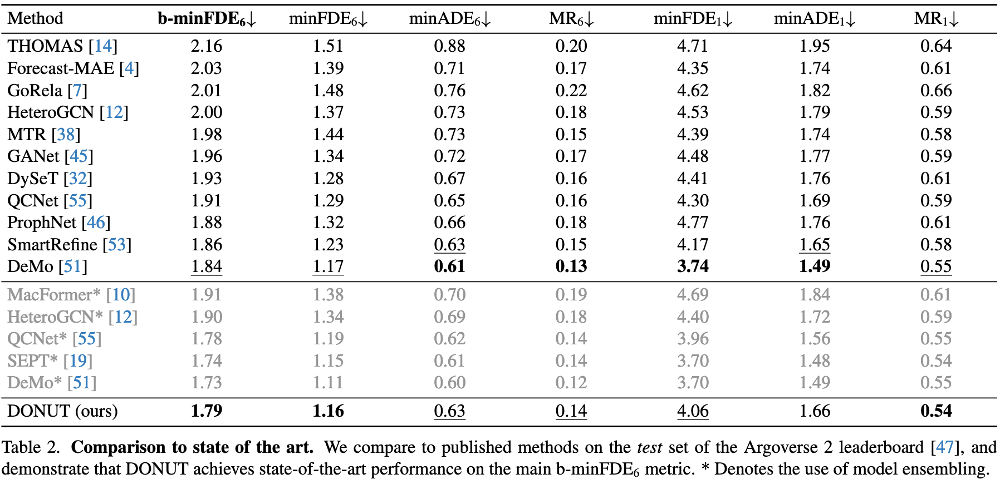

# DONUT: A Decoder-Only Model for Trajectory Prediction

## 摘要

预测场景中其他代理的运动与自动驾驶高度相关，因为它能让自动驾驶汽车进行预测。受用于语言建模的解码器模型的成功启发，我们提出了 DONUT，一种用于展开轨迹的解码器网络。与现有的编码器-解码器预测模型不同，我们对历史轨迹进行编码，并通过单一自回归模型预测未来轨迹。这样，模型就能以一致的方式进行迭代预测，并确保模型始终获得最新信息，从而提高性能。此外，受语言建模多标记预测的启发，我们引入了一种 "过度预测 "策略，赋予模型预测更长时间跨度轨迹的辅助任务。这样，模型就能更好地预测未来，进一步提高性能。通过实验，我们证明了我们的纯解码器方法优于编码器-解码器基线，并在 Argoverse 2 单个代理运动预测基准上取得了新的一流结果。

## 主要贡献

1、我们提出的 DONUT 是一种仅用于运动预测的自回归解码器模型，它使用相同的统一模型来处理历史和未来轨迹。
2、我们提出了 "过度预测 "策略，即要求模型预测更远的未来，以更好地预测未来的各种可能性。
3、利用我们的方法，我们在 Argoverse 2 基准测试中取得了最先进的性能。

## 创新思路

大多数轨迹预测模型都使用了**编码器**将历史轨迹嵌入潜在空间，同时考虑道路布局和代理互动；**解码器**利用这些历史嵌入，预测未来轨迹，并再次考虑道路几何和代理互动。但论文作者认为纯解码器架构更加适合轨迹预测模型，主要因为这种架构可以以统一的方式去处理历史和未来轨迹。

现有的encoder-decoder架构中，代理轨迹由解码器预测，编码器生成历史嵌入特征，解码器通常会一次性或者循环预测未来轨迹。
但一次性预测网络不能充分了解预测futher-future的场景元素（有一些模型采用锚点来解决该问题），如果解码器使用循环迭代来解决该问题，只能接受编码器提供的原始历史嵌入，而在预测futher-future轨迹时，这些嵌入信息可能已经过时。

因此纯解码器网络统一处理历史时间步长和未来时间步长，试图解决这种局限性。

另外，考虑到这种方法和现有的自回归LLMS的相似性，最近的研究表明，LLM 额外预测未来更远的标记，并以辅助损失进行监督，这将激励模型在训练过程中更好地考虑可能的未来。
受这一发现的启发，该论文在预测未来轨迹段时，让模型不仅预测当前轨迹段，还预测下一个轨迹段。希望这种过度预测策略能让 DONUT 在进行预测时对未来有更深入的了解，从而更好地预测未来轨迹并使其更加一致。

## 方法要点
1、历史轨迹和未来轨迹被视为同一类序列数据，由同一个模型处理，消除了编码历史与预测未来之间的逻辑割裂。
2、过度预测的实现：将轨迹数据分成若干时间段$T_sub=10$，对于历史轨迹，时间段为$[-T_sub, 0]$，预测轨迹为$[0, T_sub]$，过度预测轨迹为$[T_sub, 2*T_sub]$。
每一个循环中，都包含Proposer和Refiner两个阶段，其中Proposer生成轨迹，Refiner将Proposer生成的轨迹作为历史轨迹输入，生成offset，最终修正Proposer的输出，其采用相同的架构（1、Tokenizer=>2、4层Attention Stack（参考QCNet）=>3、Detokenizer）。

## 实验

数据集：Argoverse 2

对比模型：

算力需求：4 * H100，60轮