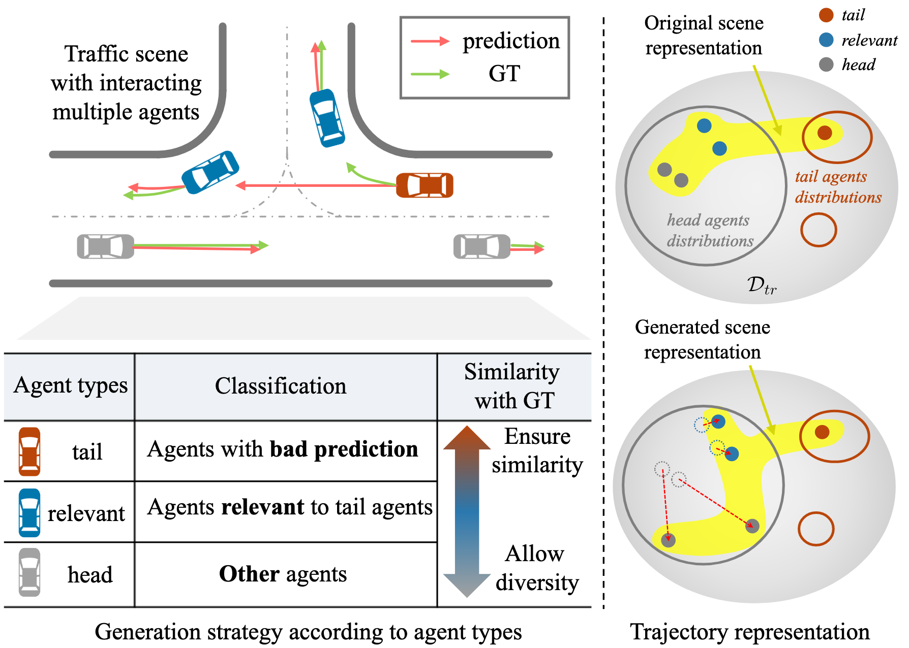

# Generative Active Learning for Long-tail Trajectory Prediction via  Controllable Diffusion Model

## 摘要
虽然数据驱动的轨迹预测提高了自动驾驶系统的可靠性，但它仍然难以应对极少观察到的长尾情况。之前的研究通过修改模型架构（如使用超网络）来解决这一问题。相比之下，我们建议改进训练过程，在不改变模型结构的情况下释放每个模型的潜力。我们介绍了用于轨迹预测的生成式主动学习（GALTraj），这是第一种将生成式主动学习成功应用于轨迹预测的方法。它能主动识别出模型失效的罕见尾部样本，并在训练过程中使用可控扩散模型来增强这些样本。在我们的框架中，最重要的是生成多样、真实并保留尾部特征的场景。因此，我们设计了一种尾部感知生成方法，该方法可应用量身定制的扩散指导，生成既能捕捉罕见行为又能遵守交通规则的轨迹。与之前只关注场景多样性的模拟方法不同，GALTraj 首次展示了模拟器驱动的增强功能如何有利于轨迹预测中的长尾学习。在多个轨迹数据集（WOMD、Argoverse2）和流行骨干网（QCNet、MTR）上的实验证实，我们的方法显著提高了尾部样本的性能，同时也提高了头部样本的准确性。

::: tip 什么是Hypernetwork
Hypernetwork（超网络）本质上是一种“生成权重的神经网络”，其核心功能不是直接处理数据，而是根据输入条件动态地为另一个“目标网络”生成参数。你可以把它形象地理解为一位即时编写菜谱的“大厨”，而目标网络则是负责执行的“机器人”，只要大厨给出不同的指令（权重），机器人就能在不改变自身结构的情况下瞬间切换工作模式。

这种架构极大地提高了模型的灵活性和参数效率，例如在 AI 绘画中，我们只需加载一个轻量级的 Hypernetwork 文件，就能通过动态调整大模型特定层的权重，让生成的图像迅速获得特定的画风或质感，而无需重新训练或存储整个庞大的模型。
:::

## 要点
- 长尾问题已在计算机视觉和机器学习中得到广泛研究，它通常被归结为类不平衡：头部类样本多，尾部类样本少。然而，在轨迹预测等回归任务中也会出现这种情况，因为罕见的驾驶行为（如U形转弯、突然超车）代表性不足。近期的研究通过修改网络架构（如添加超网络或专家模块）解决了这一问题。但是这一方法也增加了模型的复杂性，引入额外的超参数，这可能会降低头部样本的性能。
- 本篇论文主要是构建了一个“simulator-driven”的模型，使用了一个叫做 LCSim (Large-Scale Controllable Traffic Simulator) 的工具。LCSim不是基于传统物理规则的，它的内核其实是一个扩散模型。也就是说，作者把一个“生成式模型”直接称作了“模拟器”，因为它能像模拟器一样，给定一个初始状态，不断“推演”出未来的车辆轨迹，而且支持一定程度的控制。
- Tail-agent 指的是那些当前预测模型无法准确预测其未来轨迹的代理（Agent）
- 该论文采用的生成策略：尾部代理的运动应该与地面实况的未来轨迹非常相似，而头部代理则应该表现出更大的变化，偏离其原始轨迹，以引入场景级多样性，但所有头部代理的过度运动多样性会导致不合理的情景。例如，头部代理生成的运动可能会导致与尾部代理发生碰撞，从而产生不切实际的交互，所以引入相关代理（利用扩散模型中的A-A交互模块判别），表示和尾部代理有明显交互的代理。

- 对于多样性的控制策略：标准扩散生成（从纯随机噪声 $k=K$ 开始）倾向于生成数据分布中的常见模式，导致无法重现稀有的长尾行为。因此，对不同代理设定不同的起始噪声强度
  1. Tail Agents设置 $\lambda=0.25$ 以保留长尾/困难行为特征 。
  2. Relevant Agents设置 $\lambda=0.6$ 在保持交互逻辑的同时增加多样性。
  3. Head Agents 设置 $\lambda=1.0$ 最大化场景级多样性

## 主要贡献
1. 我们利用可控交通生成器，为轨迹预测任务引入了生成式主动学习，首次证明了交通仿真可成功帮助轨迹预测的长尾学习。
2. 我们提出了一种尾部感知生成方法，该方法可为每个代理类别分配不同的指导，从而在保留关键尾部行为的同时，生成逼真、多样的尾部情景。
3. 我们的方法在多个数据集和骨干网上进行了验证，不仅在尾部样本上，而且在整个数据集上都有显著改善。

## 评估指标
1. $minADE_6$：最小平均位移误差。它计算的是预测轨迹与真实轨迹（Ground Truth）在整个预测时间段内所有时间步的平均欧几里得距离。
2. $minFDE_6$：最小终点位移误差。它只计算预测轨迹的最后一个时间步（终点）与真实终点之间的距离。
::: info “6”的含义
由于轨迹预测通常会输出多个可能的未来（多模态），这里指的是从输出的 6 条预测轨迹中，选取与真实轨迹最接近的那一条来计算误差 。
:::
3. Top k% Error (Top 1%)：前 k% 困难样本误差，关注的是那些对模型来说最难预测的样本。首先使用预训练模型计算所有样本的预测误差，然后筛选出误差最大的前 $k\%$，计算这些样本的平均误差。
4. $VaR_{\alpha}$ (Value-at-Risk)：风险价值，它预测误差分布的第 $\alpha$ 分位数（quantile）。例如 $VaR_{999}$ 表示的是误差分布中第 99.9% 处的误差值。论文中具体使用了 $VaR_{999}$。衡量的是模型在“最坏情况下”的表现，数值越低，说明模型在极端情况下的表现越稳定，误差分布的“长尾”越短。

## 数据集
1. WOMD（Waymo Open Motion Dataset）是由 Waymo 发布的一个大规模自动驾驶运动预测数据集 ，它专注于解决复杂交通场景下的交互式轨迹预测问题 。该数据集包含了丰富且高度互动的真实驾驶场景，要求模型能够根据历史观测数据预测场景中所有代理（如车辆、行人）的未来运动状态 。在这篇论文中，WOMD 被用作评估模型性能的核心基准之一，作者利用它来验证所提出的生成式主动学习方法能否有效提升模型在长尾（即稀有、困难）样本上的预测准确性 。
2. Argoverse 2